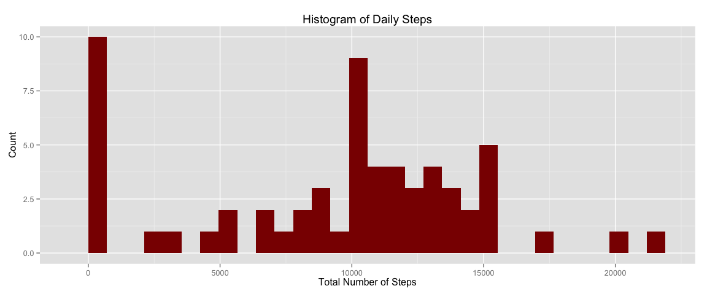

# Reproducible Research: Peer Assessment 1


## Loading and preprocessing the data

```r
# Load libraries that are needed:
library(data.table)
library (ggplot2)
library(scales)
library(plyr)
library(Hmisc)
```

```
## Loading required package: grid
## Loading required package: lattice
## Loading required package: survival
## Loading required package: Formula
## 
## Attaching package: 'Hmisc'
## 
## The following objects are masked from 'package:plyr':
## 
##     is.discrete, summarize
## 
## The following objects are masked from 'package:base':
## 
##     format.pval, round.POSIXt, trunc.POSIXt, units
```

```r
# Load file
activity <- read.csv(unz("activity.zip", filename = "activity.csv"))

# Process dates as date class
activity$date <- as.Date(activity$date)
```
  

## What is mean total number of steps taken per day?

```r
# Use data table to aggregate steps by date
DT <- as.data.table(activity)
dailySteps <- DT[, list(totalSteps = sum(steps, na.rm = T)), by = date]

# Plot histogram
g <- ggplot(dailySteps, aes(totalSteps))
g + geom_histogram(fill = "red4") + 
    labs(title = "Histogram of Daily Steps", x = "Total Number of Steps", y = "Count")
```

 

```r
# Find mean and median
meanSteps <- mean(dailySteps$totalSteps)
medianSteps <- median(dailySteps$totalSteps)
```

The mean of the total number of steps taken per day is: 9354.2295082 steps.  
The median of the total number of steps taken per day is: 10395 steps.  

## What is the average daily activity pattern?

```r
# Use data table to find means by interval 
intervalSteps <- DT[, list(meanSteps = mean(steps, na.rm = T)), by = interval]

# In order to display intervals correctly a sequence of datetime values
# in 5 minute intervals is added
intervalSteps$timeInts <- seq(ISOdatetime(2012,10,1,0,0,0), 
                              ISOdatetime(2012,10,1,23,55,0), by=(60*5))

# Plot the time sequence 
h <- ggplot(intervalSteps, aes(timeInts ,meanSteps))
h + geom_line(color = "red4") + 
    scale_x_datetime(breaks = date_breaks("2 hour"), 
                     minor_breaks = date_breaks("30 min"), 
                     labels = date_format("%H:%M")) + 
    labs(title = "Mean Number of Steps in 5 Minute Intervals", 
         x = "Intervals", y = "Mean Steps")
```

 

```r
# Find the interval with the highest average steps
maxInterval <- format(intervalSteps$timeInts[[which.max(intervalSteps$meanSteps)]], 
                      "%H:%M")
```
The 5 minute interval with maximum average steps is: 08:35  

## Imputing missing values

```r
nas <- is.na(activity$steps)
countNas <- sum(nas)
```
The total number of missing values in the data set is: 2304  


```r
# Impute missing values with the mean of each 5 minute interval 
impDT <- as.data.table(ddply(activity, "interval", mutate, steps = impute(steps, mean)))
```
Missing values are imputed using the mean of the missing value's 5 minute interval.  


```r
# Round the steps to integers
impDT$steps <- round(impDT$steps)
impDT$steps <- as.integer(impDT$steps)

# Use data table to aggregate steps by date
impDailySteps <- impDT[, list(totalSteps = sum(steps)), by = date]

# Plot histogram
i <- ggplot(impDailySteps, aes(totalSteps))
i + geom_histogram(fill = "blue4") + 
    labs(title = "Histogram of Daily Steps with Imputed Values", 
         x = "Total Number of Steps", y = "Count")
```

 

```r
# Calculate mean and median
options(scipen=999)
impMeanSteps <- mean(impDailySteps$totalSteps)
impMedianSteps <- median(impDailySteps$totalSteps)
```
The mean of the total number of steps taken per day is: 10765.6393443 steps.  
The median of the total number of steps taken per day is: 10762 steps.

With the imputed values both, the mean and the median of the number of steps taken per day increased.

## Are there differences in activity patterns between weekdays and weekends?

```r
# Add variable weekday with two factors "weekday" and "weekend" based on the date
impDT <- mutate(impDT, weekday = ifelse(weekdays(impDT$date) %in% c("Saturday", "Sunday"), "weekend", "weekday"))

# This bit is somewhat clunky, and there's probably a much more
# elegant way of doing it in R.
# Create two separate data tables with average steps per day
# Temp1 is for weekdays and Temp2 for weekends
# Add relevant factor: weekday/weekend
# Change interval to date format for plotting

temp1 <- subset(impDT, weekday == "weekday")
temp1 <- temp1[, list(meanSteps = mean(steps)), by = interval]
temp1$weekday <- "weekday"
temp1$interval <- seq(ISOdatetime(2012,10,1,0,0,0), ISOdatetime(2012,10,1,23,55,0), by=(60*5))

temp2 <- subset(impDT, weekday == "weekend")
temp2 <- temp2[, list(meanSteps = mean(steps)), by = interval]
temp2$weekday <- "weekend"
temp2$interval <- seq(ISOdatetime(2012,10,1,0,0,0), ISOdatetime(2012,10,1,23,55,0), by=(60*5))

# Combine the data tables into a single one
interSteps <- rbind(temp1, temp2)

# Make panel plot 
j <- ggplot(interSteps, aes(interval, meanSteps))
j + geom_line(color = "blue4") + 
    facet_grid(weekday ~ .) +
    scale_x_datetime(breaks = date_breaks("2 hour"), 
                     minor_breaks = date_breaks("30 min"), 
                     labels = date_format("%H:%M")) + 
    labs(title = "Mean Number of Steps in 5 Minute Intervals for Weekdays and Weekends", 
         x = "Intervals", y = "Mean Steps")
```

 


